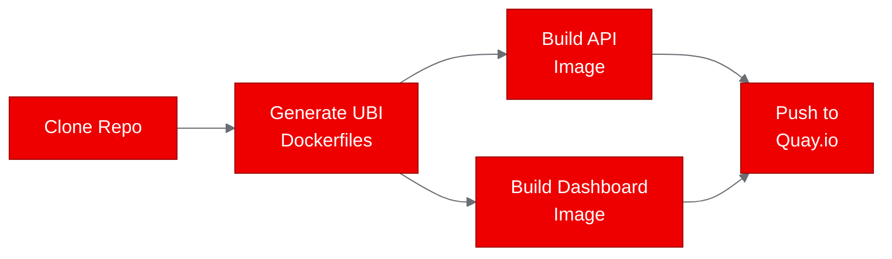
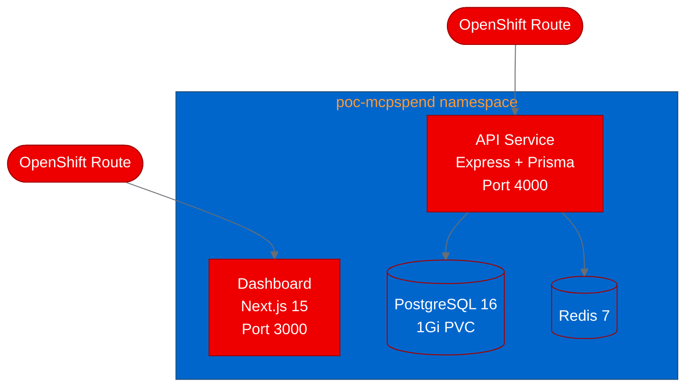

## Deploying MCPSpend on Red Hat OpenShift: tracking MCP tool call costs in production

As AI agents become more capable, they're making more tool calls, and those calls cost money. MCPSpend is an open source platform that tracks MCP (Model Context Protocol) tool call costs in real time, giving teams visibility into what their AI infrastructure actually costs. We wanted to find out how well this multi-component application runs on Red Hat OpenShift, so we deployed it from source to a running cluster using UBI-based containers.

Here's what we did, what broke, and what we learned.

## What is MCPSpend?

MCPSpend is a monorepo built with pnpm workspaces and Turborepo. It has four main components: an Express API with Prisma ORM for data access, a Next.js 15 dashboard for visualization, PostgreSQL for persistence, and Redis for caching. The API ingests tool call cost data and exposes it through REST endpoints, while the dashboard renders spend analytics in the browser.

The project targets teams running MCP-based AI agents who need to understand and control their infrastructure costs. It's a natural fit for running alongside AI workloads on OpenShift AI, where cost observability across namespaces and projects matters.

## Analyzing the repository

We started by cloning the repo and identifying its components. The monorepo structure made this straightforward:

- `apps/api`: Express + Prisma, listens on port 4000
- `apps/dashboard`: Next.js 15, listens on port 3000
- `packages/`: Shared TypeScript packages
- Infrastructure deps: PostgreSQL 16, Redis 7

No GPU requirements, no ML model serving, no LLM API keys needed. This is a standard web application with database dependencies, classified as a `web-app` type for our PoC pipeline.

## Containerizing for OpenShift

We generated two UBI-based Dockerfiles using `registry.access.redhat.com/ubi9/nodejs-20` as the base image. UBI (Universal Base Image) containers are the standard for OpenShift deployments because they receive Red Hat security patches and are tested for compatibility with the platform's security constraints.

Both Dockerfiles follow a multi-stage build pattern:

1. Install dependencies with pnpm in a build stage
2. Run the Turborepo build for the specific app
3. Copy only production artifacts to a slim runtime stage
4. Run as a non-root user with dropped capabilities

### The gray-matter build failure

The dashboard build failed on our first attempt. The culprit was `gray-matter`, a Markdown front matter parser used by the blog section of the dashboard. During Next.js static page generation, `gray-matter` loaded a version of `js-yaml` that threw a runtime error. The blog content wasn't essential for the PoC, so we fixed this by adding a step to remove `apps/dashboard/content/blog/` before the build. The dashboard built cleanly after that.

This is a common pattern we see in PoC deployments: optional features that work fine in development can break production builds due to transitive dependency conflicts. Removing non-essential content during containerization is a pragmatic fix.

## Deploying to the cluster

We generated Kubernetes manifests for all four components and deployed them to the `poc-mcpspend` namespace:

The deployment includes:

- **PostgreSQL** with a 1Gi PersistentVolumeClaim for data durability, using the Red Hat certified `rhel9/postgresql-16` image
- **Redis** for session caching and rate limiting
- **API and dashboard** pods with readiness and liveness probes
- **OpenShift Routes** exposing both services externally
- **Security contexts** dropping all Linux capabilities and disabling privilege escalation

Each pod is allocated 512Mi to 1Gi of memory and 250m to 500m CPU, which is conservative but sufficient for PoC validation.

## Running the PoC tests

We wrote a Python test script that validates three scenarios against the deployed services:

| Scenario | What it tests | Result | Duration |
|---|---|---|---|
| api-health | `GET /health` returns `{"status":"ok"}` | Pass | 0.03s |
| dashboard-load | `GET /` returns an HTML page | Pass | 0.01s |
| api-public-status | `GET /api/public/status` returns 200 | Pass | 0.06s |

All three scenarios passed on the first run. Response times under 100ms across the board confirm that inter-service communication within the namespace works as expected.

## What we learned

**Monorepo builds need isolation.** The pnpm workspace structure means that building one app can pull in dependencies from unrelated packages. The `gray-matter` issue in the dashboard was caused by a blog feature that had nothing to do with the cost tracking functionality. Containerizing each app independently with targeted build steps is the right approach.

**UBI images work well for Node.js monorepos.** The `ubi9/nodejs-20` base image includes everything needed for pnpm and Turborepo builds. We didn't need to install additional system packages or work around missing libraries.

**OpenShift security constraints are compatible out of the box.** Running containers as non-root with dropped capabilities required no code changes to MCPSpend. The application was already well-structured for containerized deployment.

**Cost tracking belongs close to the workloads.** Deploying MCPSpend on the same OpenShift cluster as AI workloads means tool call cost data stays within the cluster network. This reduces latency for cost ingestion and keeps sensitive pricing data off the public internet.

## Try it yourself

The full deployment is available in our fork:

- **Fork**: [aicatalyst-team/MCPSpend](https://github.com/aicatalyst-team/MCPSpend)
- **Manifests**: `kubernetes/` directory on the `autopoc-artifacts` branch
- **Test script**: `poc_test.py` on the `autopoc-artifacts` branch
- **Images**: `quay.io/aicatalyst/mcpspend-api:latest` and `quay.io/aicatalyst/mcpspend-dashboard:latest`

To deploy on your own OpenShift cluster, apply the manifests in order: namespace, secrets, postgres, redis, api, dashboard. The API and dashboard routes will be created automatically by OpenShift.

For production use, we'd recommend replacing hardcoded database credentials with the External Secrets Operator, adding a PostgreSQL operator like Crunchy for automated backups, and configuring Horizontal Pod Autoscalers for the API and dashboard deployments.
