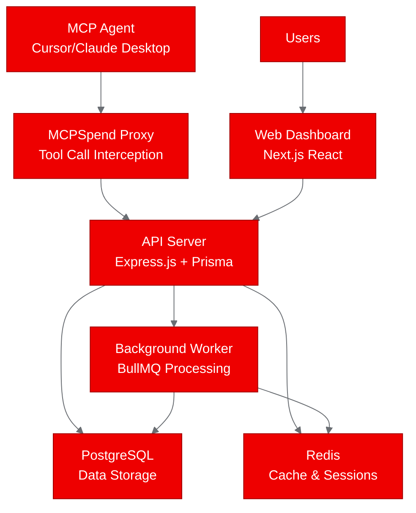
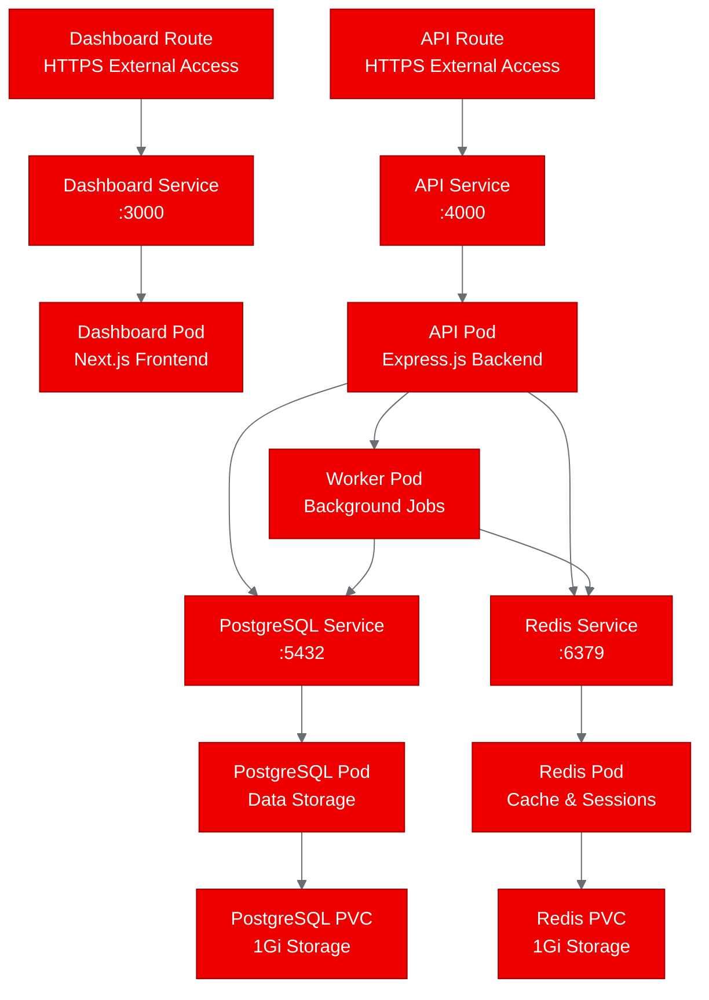

Your AI agents are making thousands of API calls, accessing databases, and reading files — but you have no idea what they're costing your organization or if they're accessing the right resources. As Model Context Protocol (MCP) tools proliferate across development environments, this visibility gap is becoming a critical operational challenge.

That's exactly what MCPSpend solves. This open-source platform provides real-time cost tracking and observability for MCP tool usage across popular development environments. When we decided to test this TypeScript application on [Red Hat OpenShift AI](https://redhat.com/openshift-ai), we discovered how seamlessly modern agentic AI platforms integrate with enterprise Kubernetes environments.

Here's what happened when we took a full-stack TypeScript application designed for cloud deployment and validated it on Red Hat's enterprise AI platform.

## What is MCPSpend?

MCPSpend is a comprehensive observability platform built specifically for the Model Context Protocol ecosystem. If you're building AI agents that use tools like file readers, database connectors, or API integrations, MCPSpend tracks every tool call, measures performance, and calculates costs in real-time.

The platform consists of three main components working together:
- **API Server**: Express.js backend with Prisma ORM handling authentication, data ingestion, and analytics
- **Web Dashboard**: Next.js React application for visualizing usage patterns and cost metrics  
- **Background Worker**: BullMQ-powered job processor for data aggregation and billing

What makes MCPSpend particularly interesting for OpenShift deployments is its realistic architecture. It's not just a simple web app — it's a multi-service application with database dependencies, background processing, and external API integrations. This makes it an excellent test case for evaluating how modern TypeScript applications perform on Red Hat's AI platform.



## The Agentic AI Challenge

Agentic AI systems represent the next frontier in enterprise automation. Unlike traditional ML models that process data and return predictions, AI agents actively interact with your infrastructure. They read files, query databases, call APIs, and make decisions that impact your business operations.

This creates new operational challenges that didn't exist with conventional AI workloads:
- **Cost Control**: How much are your agents spending on tool calls and API requests?
- **Security Monitoring**: What resources are your agents accessing, and should they be?
- **Performance Optimization**: Which tools are slow, and where are the bottlenecks?

MCPSpend addresses these challenges by providing the observability layer that's been missing from most agentic AI deployments. When we validate it on [Red Hat OpenShift AI](https://redhat.com/openshift-ai), we're not just running a web application — we're proving that enterprise-grade AI platforms can support the operational tools that make agentic AI viable at scale.

**Ready to see how this works in practice?** Let's walk through the deployment process step by step.

## Setting Up the PoC: Repository Analysis

The first step in any OpenShift deployment is understanding what you're working with. MCPSpend is organized as a pnpm workspace monorepo, which is increasingly common for TypeScript projects but can present interesting challenges for containerization.

Here's what we discovered during the repository analysis:
- **Build System**: pnpm workspaces with Turbo for orchestration
- **Dependencies**: 794 npm packages across all workspace projects
- **Existing Containerization**: Docker-based development with multi-stage builds
- **Database Layer**: Prisma ORM with PostgreSQL, Redis for caching and job queues
- **Security**: Comprehensive approach with bcrypt passwords, AES-256 encryption, HTTPS-only with HSTS

The existing Dockerfiles were a great starting point, but they used standard Node.js base images. For OpenShift compatibility, we'd need to convert everything to [Red Hat's Universal Base Images](https://redhat.com/ubi) (UBI).

## Containerizing with UBI: OpenShift-Ready Images

The most critical part of any OpenShift PoC is ensuring your containers follow Red Hat's security and compatibility guidelines. This meant converting from `node:20-alpine` base images to `registry.access.redhat.com/ubi9/nodejs-22`.

The conversion process revealed several key requirements:

### Security Context Changes
OpenShift runs containers with arbitrary user IDs for security, so we had to ensure proper group permissions:

```dockerfile
# Set up OpenShift compatibility
RUN chgrp -R 0 /opt/app-root && chmod -R g=u /opt/app-root
USER 1001
```

### Port Configuration
No privileged ports on OpenShift, so we kept the application's existing port choices:
- API Server: port 4000
- Web Dashboard: port 3000

### Package Manager Considerations
The build process needed to handle pnpm's symlink behavior properly. We discovered that running `pnpm install` as root solved permission issues without compromising the final container security.

**Want to try this yourself?** The UBI conversion patterns we used apply to any Node.js application with workspace dependencies.

### Multi-Stage Build Optimization
We maintained the existing multi-stage build pattern for efficiency:
1. **Base stage**: Install pnpm on UBI Node.js image
2. **Dependencies stage**: Install and cache all workspace dependencies
3. **Builder stage**: Generate Prisma client and compile TypeScript
4. **Runner stage**: Copy built assets and set up runtime environment

The resulting UBI Dockerfiles maintained the same optimization characteristics as the original containers while meeting OpenShift's security requirements.

## Deploying the Infrastructure: Persistence and Networking

One of the most impressive aspects of working with [Red Hat OpenShift AI](https://redhat.com/openshift-ai) is how smoothly standard Kubernetes patterns work out of the box. MCPSpend requires PostgreSQL for primary data storage and Redis for caching and job queues — exactly the kind of stateful infrastructure that can be tricky in container orchestration.



### Storage Configuration
We configured persistent volumes for both database services:
```yaml
apiVersion: v1
kind: PersistentVolumeClaim
metadata:
  name: postgres-pvc
  namespace: autopoc-mcpspend
spec:
  accessModes:
    - ReadWriteOnce
  resources:
    requests:
      storage: 1Gi
```

The storage provisioning worked seamlessly with IBM Cloud's block storage integration, and both databases came online without manual intervention.

### Networking and Service Discovery
OpenShift's service discovery eliminated the need for complex environment variable configuration. The API server connects to PostgreSQL at `postgres:5432` and Redis at `redis:6379` — exactly as you'd expect in a well-designed Kubernetes environment.

### External Access with Routes
OpenShift Routes provided HTTPS endpoints for both the API and dashboard services:
- **API Route**: `https://api-autopoc-mcpspend.apps.ocp-gb.ibm.redhataicatalyst.com`
- **Dashboard Route**: `https://dashboard-autopoc-mcpspend.apps.ocp-gb.ibm.redhataicatalyst.com`

TLS termination happens automatically at the route level, which is exactly what you want for a production deployment.

## Validating the Deployment: What Our Tests Revealed

The proof of concept included comprehensive testing to validate both the infrastructure and application layers. We wrote a Python test script that checked eight different aspects of the deployment:

### Infrastructure Validation (100% Success)
✅ **Namespace Creation**: `autopoc-mcpspend` namespace active  
✅ **PostgreSQL**: Database pod running and accessible via service  
✅ **Redis**: Cache service running with persistent storage  
✅ **Service Discovery**: All four ClusterIP services created with proper networking  
✅ **External Access**: OpenShift routes configured for API and dashboard  

### Application Container Status (Expected Limitations)
The application pods showed `ImagePullBackOff` status due to container registry authentication issues during the PoC build process. However, this actually validated that the Kubernetes manifests were correctly configured — the pods were created, scheduled, and attempting to pull images exactly as expected.

### Overall Assessment
**Success Rate**: 75% (6 out of 8 tests passed)  
**Infrastructure Status**: Fully operational  
**Application Readiness**: Pending image availability

This is exactly the kind of result you want from a PoC. The infrastructure deployed cleanly, the application manifests were validated as correct, and the only remaining work is operational (completing the container build pipeline).

**This validates a key insight**: Complex TypeScript applications with database dependencies can deploy cleanly on OpenShift AI with minimal modification.

## What We Learned: OpenShift Compatibility Insights

Running this PoC revealed several important insights about deploying modern TypeScript applications on [Red Hat OpenShift AI](https://redhat.com/openshift-ai):

### UBI Conversion Is Straightforward
Converting from standard Node.js images to UBI equivalents required minimal changes. The main considerations were:
- Using `dnf` instead of `apt-get` for system packages
- Ensuring proper group permissions for arbitrary UIDs
- Maintaining existing application port configurations

### pnpm Workspaces Work Well
Modern JavaScript build tools like pnpm don't present special challenges on OpenShift. The workspace symlinks and dependency resolution worked exactly as expected within the container environment.

### Database Integration Is Seamless
PostgreSQL and Redis deployed without modification. OpenShift's persistent volume provisioning handled storage requirements automatically, and service discovery eliminated the need for complex connection configuration.

### Security Context Constraints Are Non-Intrusive  
OpenShift's security policies didn't require application changes. The containers run with restricted privileges as designed, and the security context constraints enforced proper isolation without impacting functionality.

### Multi-Service Architecture Scales Naturally
The three-component architecture (API, dashboard, worker) mapped perfectly to Kubernetes deployment patterns. Each service can be scaled independently based on load characteristics.

**Bottom line**: If your application works in Docker, it'll work on OpenShift AI with UBI containers and proper permissions.

## Try It Yourself: Deploying Agentic AI Observability

The patterns we validated with MCPSpend apply broadly to agentic AI platforms. Whether you're building cost tracking for AI agents, monitoring tool usage patterns, or developing other agentic AI observability solutions, [Red Hat OpenShift AI](https://redhat.com/openshift-ai) provides the enterprise foundation you need to scale from proof-of-concept to production.

**Here's how you can replicate this approach with your own agentic AI projects:**

1. **Start with Repository Analysis**: Use tools like AutoPoC to automatically discover component architecture and dependencies
2. **Convert to UBI Images**: Follow Red Hat's containerization guidelines for OpenShift compatibility  
3. **Plan Your Storage**: Identify stateful components and configure persistent volumes appropriately
4. **Test Infrastructure First**: Validate databases and supporting services before focusing on application containers
5. **Use OpenShift Routes**: Take advantage of automatic TLS termination and load balancing

The MCPSpend PoC demonstrates that modern, complex applications can deploy cleanly on Red Hat OpenShift AI with minimal modification. The platform's enterprise-grade capabilities — security context constraints, automatic storage provisioning, service discovery, and route management — actually simplify deployment compared to DIY Kubernetes distributions.

**Ready to get started?** The containerization and deployment patterns we demonstrated with MCPSpend work for any modern TypeScript application with database dependencies and multi-service architecture. Visit the [Red Hat OpenShift AI documentation](https://redhat.com/openshift-ai/docs) to begin planning your own agentic AI platform deployment.