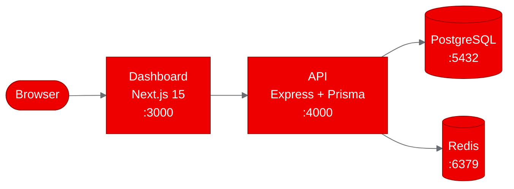
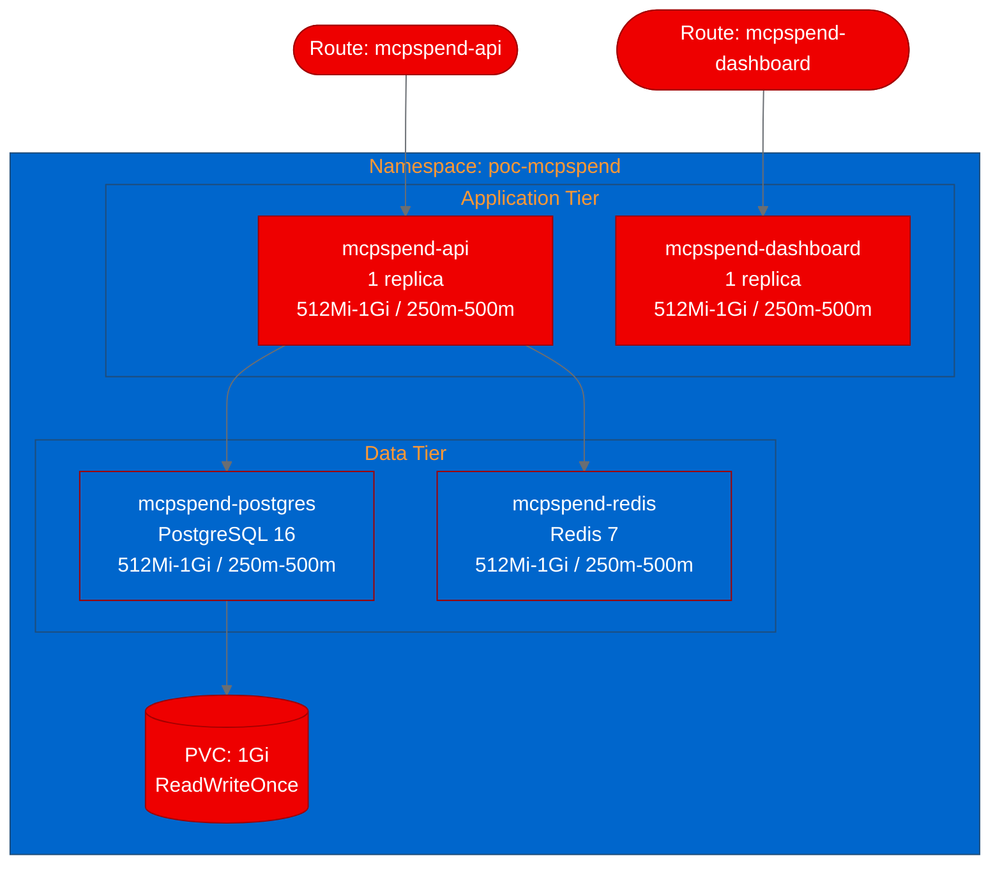

# PoC Report: MCPSpend

## 1. Executive Summary

MCPSpend is a real-time MCP (Model Context Protocol) tool call cost tracking platform consisting of an Express API, Next.js dashboard, PostgreSQL database, and Redis cache. The PoC objective was to containerize this multi-component monorepo using UBI-based images and deploy it to Red Hat OpenShift. The PoC succeeded: all four components are running in the `poc-mcpspend` namespace, and all three validation test scenarios passed. One build issue was encountered (gray-matter/js-yaml incompatibility in the dashboard's blog static generation) and resolved by removing blog content during the build.

## 2. Project Analysis

- **Repository**: `https://github.com/andreisirbu91-lab/MCPSpend`
- **Fork**: `https://github.com/aicatalyst-team/MCPSpend`
- **Description**: MCPSpend provides real-time cost tracking and analytics for MCP tool calls, helping teams monitor and optimize their AI infrastructure spend. The monorepo uses pnpm workspaces and Turborepo.

| Component | Language | Build System | ML Workload | Port |
|---|---|---|---|---|
| api | TypeScript (Express + Prisma) | pnpm / Turborepo | No | 4000 |
| dashboard | TypeScript (Next.js 15) | pnpm / Turborepo | No | 3000 |
| postgres | PostgreSQL 16 | N/A | No | 5432 |
| redis | Redis 7 | N/A | No | 6379 |

- **Project classification**: `web-app` (monorepo with API + Dashboard + Worker + PostgreSQL + Redis)
- **Technologies**: TypeScript, Node.js, Express, Prisma ORM, Next.js 15, PostgreSQL, Redis, pnpm workspaces, Turborepo

```mermaid
%%{init: {'theme': 'base', 'themeVariables': {'primaryColor': '#EE0000', 'primaryTextColor': '#fff', 'primaryBorderColor': '#A30000', 'lineColor': '#6A6E73', 'secondaryColor': '#F0F0F0', 'tertiaryColor': '#0066CC'}}}%%
graph LR
    Client([Browser]) --> Dashboard[Dashboard<br/>Next.js 15<br/>:3000]
    Dashboard --> API[API<br/>Express + Prisma<br/>:4000]
    API --> PG[(PostgreSQL<br/>:5432)]
    API --> Redis[(Redis<br/>:6379)]
```

## 3. PoC Objectives

- **Objective**: Prove that the MCPSpend multi-component application can be containerized with UBI images and deployed to OpenShift as a cohesive system.
- **Relevance to OpenShift AI**: MCPSpend tracks costs for MCP tool calls, which are increasingly used in AI agent workflows. Running the cost tracking platform on the same OpenShift cluster as AI workloads enables low-latency observability of AI infrastructure spend.
- **Infrastructure requirements**: PostgreSQL with persistent storage (1Gi PVC), Redis for caching, two application pods (API and dashboard), no GPU or LLM API access needed.

## 4. Pipeline Execution

```mermaid
%%{init: {'theme': 'base', 'themeVariables': {'primaryColor': '#EE0000', 'primaryTextColor': '#fff', 'primaryBorderColor': '#A30000', 'lineColor': '#6A6E73', 'secondaryColor': '#F0F0F0', 'tertiaryColor': '#0066CC'}}}%%
flowchart LR
    A[Intake] --> B[Evaluate]
    B --> C[Fork]
    C --> D[PoC Plan]
    D --> E[Containerize]
    E --> F[Build]
    F --> G[Deploy]
    G --> H[Apply]
    H --> I[PoC Execute]
    I --> J[PoC Report]

    style A fill:#EE0000,color:#fff
    style B fill:#EE0000,color:#fff
    style C fill:#EE0000,color:#fff
    style D fill:#EE0000,color:#fff
    style E fill:#EE0000,color:#fff
    style F fill:#EE0000,color:#fff
    style G fill:#EE0000,color:#fff
    style H fill:#EE0000,color:#fff
    style I fill:#EE0000,color:#fff
    style J fill:#EE0000,color:#fff
```

- **Intake**: Identified MCPSpend as a pnpm monorepo with `apps/api` (Express + Prisma), `apps/dashboard` (Next.js 15), and shared packages. Detected PostgreSQL and Redis dependencies.
- **Evaluate**: Classified as `web-app`. No ML workloads, no GPU requirements. Good candidate for OpenShift deployment.
- **Fork**: Forked to `https://github.com/aicatalyst-team/MCPSpend`.
- **PoC Plan**: Planned deployment of four components (API, dashboard, PostgreSQL, Redis) with three test scenarios covering health checks, dashboard rendering, and public API status.
- **Containerize**: Generated two UBI-based Dockerfiles:
  - `apps/api/Dockerfile` using `registry.access.redhat.com/ubi9/nodejs-20`
  - `apps/dashboard/Dockerfile` using `registry.access.redhat.com/ubi9/nodejs-20`
- **Build**: Initial dashboard build failed due to `gray-matter` importing an incompatible version of `js-yaml` during blog static generation. Fixed by removing blog content (`apps/dashboard/content/blog/`) before the build step. Both images built and pushed successfully on retry.
  - `quay.io/aicatalyst/mcpspend-api:latest`
  - `quay.io/aicatalyst/mcpspend-dashboard:latest`
- **Deploy**: Generated Kubernetes manifests for namespace, secrets, PostgreSQL (with PVC), Redis, API deployment + service, and dashboard deployment + service.
- **Apply**: All resources applied to `poc-mcpspend` namespace. OpenShift routes created for external access.
- **PoC Execute**: Ran `poc_test.py` in-cluster. All 3 scenarios passed.

## 5. Test Results

| Scenario | Status | Duration | Details |
|---|---|---|---|
| api-health | PASS | 0.03s | `GET /health` returned `{"status":"ok"}` |
| dashboard-load | PASS | 0.01s | `GET /` returned HTML page with `</html>` |
| api-public-status | PASS | 0.06s | `GET /api/public/status` returned 200 |

All 3 of 3 test scenarios passed successfully.

## 6. Infrastructure Deployed

```mermaid
%%{init: {'theme': 'base', 'themeVariables': {'primaryColor': '#EE0000', 'primaryTextColor': '#fff', 'primaryBorderColor': '#A30000', 'lineColor': '#6A6E73', 'secondaryColor': '#F0F0F0', 'tertiaryColor': '#0066CC'}}}%%
graph TD
    subgraph "Namespace: poc-mcpspend"
        subgraph "Application Tier"
            API[mcpspend-api<br/>1 replica<br/>512Mi-1Gi / 250m-500m]
            DASH[mcpspend-dashboard<br/>1 replica<br/>512Mi-1Gi / 250m-500m]
        end
        subgraph "Data Tier"
            PG[mcpspend-postgres<br/>PostgreSQL 16<br/>512Mi-1Gi / 250m-500m]
            RD[mcpspend-redis<br/>Redis 7<br/>512Mi-1Gi / 250m-500m]
        end
        PVC[(PVC: 1Gi<br/>ReadWriteOnce)]
    end

    Route1([Route: mcpspend-api]) --> API
    Route2([Route: mcpspend-dashboard]) --> DASH
    API --> PG
    API --> RD
    PG --> PVC

    style API fill:#EE0000,color:#fff
    style DASH fill:#EE0000,color:#fff
    style PG fill:#0066CC,color:#fff
    style RD fill:#0066CC,color:#fff
```

- **Namespace**: `poc-mcpspend`
- **Container images**:
  - `quay.io/aicatalyst/mcpspend-api:latest`
  - `quay.io/aicatalyst/mcpspend-dashboard:latest`
  - `registry.redhat.io/rhel9/postgresql-16:latest`
  - `redis:7-alpine`
- **Kubernetes resources**:
  - 4 Deployments (api, dashboard, postgres, redis)
  - 4 Services (ClusterIP)
  - 2 Routes (api, dashboard)
  - 1 PersistentVolumeClaim (1Gi for PostgreSQL)
  - 1 Secret (database URL, Redis URL, JWT secret)
  - 1 Namespace
- **Routes**:
  - API: `mcpspend-api-poc-mcpspend.apps.ocp-gb.ibm.redhataicatalyst.com`
  - Dashboard: `mcpspend-dashboard-poc-mcpspend.apps.ocp-gb.ibm.redhataicatalyst.com`
- **Resource allocations** (per pod): 512Mi-1Gi memory, 250m-500m CPU
- **PVC**: 1Gi ReadWriteOnce for PostgreSQL data

## 7. Recommendations

### Production Readiness
- **Database credentials**: The current deployment uses hardcoded PostgreSQL credentials in the manifest. For production, use OpenShift Secrets managed externally (e.g., Vault or External Secrets Operator).
- **Redis persistence**: Redis is running without persistence. Consider adding a PVC or switching to a managed Redis service for production.
- **TLS**: Routes should be configured with edge TLS termination for production traffic.

### Performance Observations
- All test responses completed in under 100ms, indicating healthy pod startup and low-latency inter-service communication.
- Single-replica deployments are sufficient for PoC but should be scaled for production load.

### Security Considerations
- All containers run with `allowPrivilegeEscalation: false` and drop `ALL` capabilities.
- The API image uses UBI9 Node.js 20, which receives Red Hat security patches.
- Redis uses `redis:7-alpine` rather than a UBI image. For production on OpenShift, consider `registry.redhat.io/rhel9/redis-7`.

### Scalability
- The API and dashboard deployments can be horizontally scaled with HPA.
- PostgreSQL would need a StatefulSet or an operator (e.g., Crunchy PostgreSQL) for multi-replica setups.

### Next Steps
1. Configure Horizontal Pod Autoscaler for API and dashboard
2. Replace hardcoded credentials with External Secrets Operator
3. Add NetworkPolicies to restrict inter-pod communication
4. Set up a PostgreSQL operator for automated backups and failover
5. Enable Redis persistence or migrate to a managed Redis instance

## 8. Open Data Hub / OpenShift AI Considerations

MCPSpend is not an ML workload itself, but it provides cost observability for MCP tool calls, which are foundational to AI agent orchestration.

- **Relevant ODH components**: None directly required, but MCPSpend complements workloads managed by KServe and Data Science Pipelines by tracking the cost of tool calls made by AI agents.
- **Migration path**: The current vanilla Kubernetes deployment is already OpenShift-compatible (UBI images, security contexts, routes). No ODH-specific changes are needed.
- **Recommendations**: MCPSpend could be deployed as a shared service in an OpenShift AI cluster, providing cost tracking across multiple data science projects and namespaces. Integration with OpenShift monitoring (Prometheus/Grafana) would enable unified cost dashboards.

## 9. Appendix

### Artifacts
- **PoC test script**: [`poc_test.py`](poc_test.py)
- **Kubernetes manifests**: [`kubernetes/`](kubernetes/)
  - `namespace.yaml`, `secrets.yaml`, `postgres.yaml`, `redis.yaml`, `api.yaml`, `dashboard.yaml`
- **Fork repository**: `https://github.com/aicatalyst-team/MCPSpend`
- **Artifacts branch**: `autopoc-artifacts`

### Build Issues Encountered
1. **Dashboard build failure (retry 1)**: The Next.js dashboard build failed because `gray-matter` (used for blog post parsing) imported an incompatible version of `js-yaml` that threw errors during static page generation. The fix was to remove the `apps/dashboard/content/blog/` directory before the build step in the Dockerfile, bypassing blog static generation entirely.

### Retry Summary
- Build retries: 1 (dashboard Dockerfile fix)
- Deploy retries: 0
